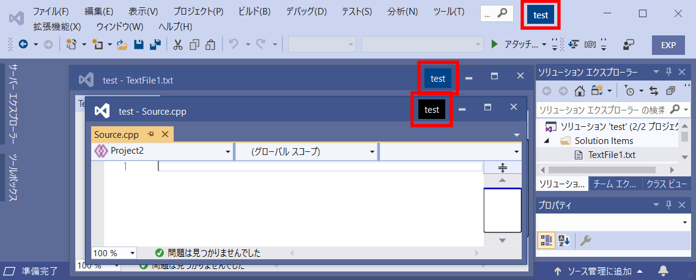

# miSolutionName

Modify solution name ui in title bar for Visual Studio 2019.  
Visual Studio2019の右上に表示されるソリューション名のUIをカスタマイズします。

# Feature/機能

* Change solution name ui background/foreground color.  
  右上に表示されるソリューション名のUIの配色を変更します。
* Specify different colors when window active and inactive.  
  ウィンドウのアクティブ状態に応じて異なる配色を指定できます。
* Add solution name ui to sub window.  
  メインウィンドウ以外のウィンドウにもソリューション名のUIを追加します。
* Work with [Window Colors(for VSCode)](https://github.com/stuartcrobinson/unique-window-colors)  
  This extension can load Window Colors config file(WIP).

# Usage/使い方
* DefaultColor/デフォルト配色  
  You can set colors in Visual Studio Options. This setting will apply to any  
  solution except enable .suo specific option.  
  If you want to change colors, Open [Tools]>[Options]>[Environment]>[miSolutionName].  
  
  VisualStudioのオプションでデフォルトの配色を設定できます。この設定は.suo固有の  
  オプションが無効のソリューションに適用されます。  
  変更するには「ツール」>「オプション」>「環境」>「miSolutionName」を開きます。  
  
* .suo-Specific Option/.suo固有の設定
  Solution User Option(.suo) specific setting.  
  If Enabled, you can change colors per solution.  
  If you want to set colors, Open Editor [Extensions]>[miSolutionName Setting] and,  
  (1) Check [Enable .suo Options]  
  (2) Fill colors text box(hex color format).  
  Those settings will saved to .suo file. So you have to set per solution.  
  
  ソリューションユーザーオプション固有の設定を変更できます。  
  この設定を有効にするとソリューションごとに配色を指定することができます。  
  有効にするには「拡張機能」>「miSolutionName設定」でエディターを開き、  
  (1) 「.suoに格納されている設定を有効にする」にチェックを入れ  
  (2) 配色内のテキストボックスにカラーコードを入力してください。  
  これらの設定は.suoファイルに保存されるため、ソリューションごとに設定する必要があります。  

# Misc
Konyanyatiwa. This is a Japasene. Kore, nihongo yanen.
Eigo kakuno mendoi nen. Nihongo de yurusitena.
Kore, "Kaisya" de hukusuu no branch de sagyou siteiruto window no kubetu ga
tukanakunari, komarunode tukuttan. VSSolutionColor Extension ga Visual Studio 2019
de umaku ugokanen, nande kore tukutta. Ato, onazi project de VSCode mo tukaunen,
Window Colors Extension de branch gotoni window no iro kaetenen.
Nande kore tukuttan. Hona sainara.

# Related Projects/関連するプロジェクト
* https://github.com/stuartcrobinson/unique-window-colors  
Visual Studio Code Extension. 
* https://github.com/mayerwin/vs-customize-window-title/  
Visual Studio Extension. 
* https://github.com/Wumpf/VSSolutionColor  
Visual Studio Extension. 
